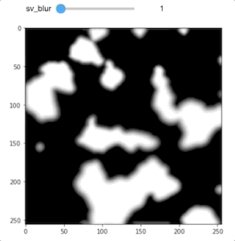

### Portrait Shadow Manipulation (SIGGRAPH 2020)

<a href="https://people.eecs.berkeley.edu/~cecilia77/project-pages/portrait.html" target="_blank">Project Website</a>

<hr>

Tensorflow 1.15.2 has been tested for the following implementation. 

This repo contains the following contents:

```
$PWD
│   README.md
│   utils.py: foreign shadow synthesis steps
│	  including color jitter, subsurface scattering approximation,
│	  spatially-varying blur and per-pixel variations, and common util functions.
│   datasets.py: build the computational graph for training data generation.
│   mkdataset.py: offline data generatin script, saving generated images to disk.
│   mkfilelist.py: generate training / evaluation / test txt file for training.
│	test.txt: an example txt for training.
│
└───input: portrait image that is free of foreign shadow (ok to contain facial shadow)
│   │   000.png
│   │   001.png
│   │	  ...
│
└───input_mask_ind: segmentation and bounding box for each individual face
│   │   000_0.png
│   │   000.txt
│   │   001_0.png
│   │   001_1.png
│   │   001.txt
│   │   ...
│
└───silhouette
│   │   ...

```

### Prepare your (foreign shadows) training dataset

If you want to get a quick idea how the images are generated, you can jump to step 4 and refer to the jupyter notebook.

**Step 0 (pre-req):**

For each image, you need to have a portarit segmentation and face bounding box for each face in the image. We used the model from [this paper](https://arxiv.org/abs/1806.04171), but there are other publicly avaialble portrait segmentation and face detectors that you can use.

We provide some exmples in this repo, see step 1.

**Step 1:**

Here's the structure of our datasets:

`input/`: folder that contains input images (no foreign shadows but may contain facial shadows)

`input_mask_ind/`: folder that contains **individual** face segmentation (.png) and bounding box (i.e. bbox) stored in .txt (each line corresponds to one face bbox). For example, for an input image `0.png` in `input/`, `0_0.png` denotes the first face in `0.png` and `0_1.png` denotes the second face in `0.png`. `0.txt` will contain two lines corresponding to the two bbox of the faces in `0.png`.

`silhouette/`: We randomly choose to generate shadow using either perlin noise or silhouette, and this folder is to store all the random silhouette images.

**Step 2:**

Generate train / eval txt file, run `mkfilelist.py`. For example:

```
python3 mkfilelist.py \
	--image_base_paths ${your_parent_path}/input \
	--silhouette_paths ${your_parent_path}/silhouette \
	--file_types png \
	--output_dir ${your_parent_path}/test.txt
```

`example.txt` is an example .txt file that this script generates. During training or offline data generation, it reads in this .txt file.

**Step 3:**

Decide how you want to use the training data. There are two ways (both are provided) to use the training dataset: 

1. Offline: you can use the script (`mkdataset.py`) to generate and save out generated image pairs to disk.
2. On-the-fly: you can use the `datasets.py` to build the data generation graph as part of the training computation graph, and generate data on the fly while training. 

All the key synthesis functions described in paper Section 3 are implemented in `utils.py`* with detailed function documentation. To generate image pairs offline, run `mkdataset.py`. For example:

```
python3 mkdataset.py \
	--mode train \
	--trainwildpaths ${your_parent_path}/train.txt \
	--silhouette_paths ${your_parent_path}/eval.txt \
	--out_dir ${your_parent_path}/shadow_data \
```

Example ouput can be found under `./example_out/`. You should expect generated image pairs to be similar to this.


*All synthesis functions in `utils.py` are implemented in tensorflow and it was meant for on-the-fly training data generation. If you use the script only for offline data generation and you don't have hardware for parallelization, some of the operation may not be computational efficient.

**Step 4 (optional):**

For a quick demo of each synthesis step, we also provide a jupyter notebook (`foreign_syn.ipynb`) that goes through the entire synthesis process. A few control parameters can be visualized interactively. For example, the strength of subsurface scattering approximation and spatially varying blur size:





---
### Symmetry
To come

---
### Test
To download all test and evaluation dataset, please see project website.

Some of the test images come from:

[Helen dataset](http://www.ifp.illinois.edu/~vuongle2/helen/): Face dataset with landmarks

[HDR+ Burst Photography Dataset](https://hdrplusdata.org): Test images with faces

At this point, we cannot make the trained model public due to legal reasons.

---
### Relevant links
These resources help me directly and indirectly understand this problem better:

[Marc Levoy Lecture](https://graphics.stanford.edu/courses/cs178-13/lectures/lighting-23may13.pdf): Photographic lighting

[cambridgeincolour](https://www.cambridgeincolour.com/tutorials/portrait-lighting.htm): Introduction to portrai lighting with interactive demo

[Lighting setup taxonomy](https://www.digitalcameraworld.com/tutorials/cheat-sheet-pro-portrait-lighting-setups): Pro portrait lighting setups with illustration

[Canon tutorial](https://www.usa.canon.com/internet/portal/us/home/learn/education/topics/article/2018/August/Natural-Light-Portraiture/Natural-Light-Portraiture?fbclid=IwAR3Eyz5BgNJly_sublDZtLcHVGAESeT_yc4zGjSfP2BI-046x2Zy-JmDoS4): Natural Light Portraiture

---
### Acknowledgement
We are grateful for people who agree to appear in all the photographs. Please use these photos only for academic purpose, and use with respect. Thank you.